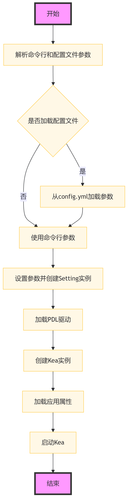

命令行交互功能
====================

本部分旨在解释 Kea 的命令行界面（CLI）是如何设计及实现的，包括如何处理命令行参数、YAML 配置文件以及参数清洗。

功能说明与功能设计
--------------------

下述流程图的介绍了Kea工具CLI的启动和配置过程。涵盖了从命令行参数解析、配置文件加载、测试环境设置到自动化测试执行的整个自动化测试准备和启动过程。通过这种方式，用户可以灵活地配置测试环境，并自动化地执行测试用例。

    CLI实现的流程图

具体执行步骤如下：

1. **解析命令行和配置文件参数** 
   
   - 使用 ``argparse`` 库创建一个参数解析器。
   - 定义接受的命令行参数，例如 ``-f`` 用于指定性质文件，``-d`` 用于指定设备序列号等。
   - 解析命令行输入的参数。

2. **检查是否加载配置文件**
   
   - 检查命令行参数中是否包含了 ``--load_config`` 标志，该标志指示是否从配置文件 ``config.yml`` 中加载参数。

3. **从`config.yml`加载参数**
   
   - 如果指定了 ``--load_config`` ，则调用 ``load_ymal_args`` 函数从 ``config.yml`` 文件中读取参数。
   - 这些参数会覆盖命令行中指定的参数。

4. **使用命令行参数**
   
   - 如果没有指定 ``--load_config`` ，则直接使用命令行解析得到的参数。

5. **设置参数并创建`Setting`实例**
   
   - 根据解析得到的参数，创建一个 ``Setting`` 类的实例，该实例包含了所有需要的配置信息。

6. **加载PDL驱动**
   
   - 根据 ``Setting`` 实例中的 ``is_harmonyos`` 属性判断目标设备是Android还是HarmonyOS。
   - 根据平台加载相应的PDL（Property Description Language）驱动。

7. **创建`Kea`实例**
   
   - 创建 ``Kea`` 类的实例， ``Kea`` 可能是一个自动化测试框架的核心类。

8. **加载应用性质**
   
   - 使用 ``Kea.load_app_properties`` 方法加载需要测试的应用性质，这些性质定义了要测试的应用行为。

9. **启动`Kea`**
    
   - 调用 ``start_kea`` 函数，传入 ``Kea`` 实例和 ``Setting`` 实例，开始执行自动化测试流程。
   - ``start_kea`` 函数会初始化 ``DroidBot`` ，它是 ``Kea`` 的数据生成器，并启动测试。

命令行参数解析
----------------

Kea 使用 `argparse` 库来解析命令行参数。以下是主要的命令行参数：

- ``-f`` 或 ``--property_files``: 指定要测试的应用性质文件。
- ``-d`` 或 ``--device_serial``: 指定目标设备的序列号。
- ``-a`` 或 ``--apk``: 指定待测应用安装包文件的路径，或待测应用的包名。
- ``-o`` 或 ``--output``: 指定输出目录，默认为 "output"。
- ``-p`` 或 ``--policy``: 指定输入事件生成策略，默认为 "random"。
- ``-t`` 或 ``--timeout``: 指定超时时间（秒），默认为预设值。
- ``-debug``: 开启调试模式，输出调试信息。
- ``-keep_app``: 测试后保留设备上的应用。
- ``-grant_perm``: 安装时授予所有权限，对 Android 6.0+ 有用。
- ``-is_emulator``: 声明目标设备为模拟器。
- ``-is_harmonyos``: 使用 HarmonyOS 设备。
- ``-load_config``: 从 ``config.yml`` 加载参数，命令行参数将被忽略。

YAML 配置文件
--------------

Kea 支持通过 YAML 配置文件（``config.yml``）来指定参数，以简化参数的配置过程。YAML 文件中的参数值将覆盖命令行参数。

.. 
 参数清洗
 ----------
 参数清洗是通过 `sanitize_args` 函数实现的，该函数确保参数的有效性和一致性。

参数对象
----------

Kea 使用 `dataclass` 定义了一个名为 `Setting` 的参数对象，用于存储和传递参数。这个对象包含了所有与测试相关的配置。

启动 Kea
----------

以下是 Kea 启动流程的简要说明：

1. 解析命令行参数和 YAML 配置文件。
2. 设置参数对象 `Setting`。
3. 根据目标平台加载相应的 PDL 驱动。
4. 创建 Kea 实例并加载应用性质。
5. 启动 Kea 进行测试。

主要函数设计
--------------------

以下是 Kea CLI 中每个主要函数的功能介绍：

- `parse_args` 函数：
    - 负责解析命令行输入的参数。
    - 根据用户输入设置相应的命令行参数，并处理 `-load_config` 选项以决定是否从 YAML 配置文件中加载参数。
  
    其简化代码如下：

.. code-block:: python 

    def parse_args():
        parser = argparse.ArgumentParser(...)
        parser.add_argument(...)
        options = parser.parse_args()

        # load the args from the config file `config.yml`
        if options.load_config:
            options = load_ymal_args(options)

        # sanitize these args
        sanitize_args(options) 

        return options

- `load_yaml_args` 函数：
    - 负责从 `config.yml` YAML 配置文件中读取参数。
    - 将配置文件中的参数值应用到参数对象中，覆盖命令行输入的参数。
  
    其简化代码如下：

.. code-block:: python

    def load_yaml_args(opts):
        config = get_yml_config()
        key_map = {...}
        for key, value in config.items():
            key_lower = key.lower()
            if value and key_lower in key_map:
                key_map[key_lower](value)
            
        return opts

- `sanitize_args` 函数：
    - 对解析后的参数进行清洗和验证。
    - 确保所有参数在传递给 Kea 之前都是有效和一致的。
  
    其简化代码如下：

.. code-block:: python
    
    def sanitize_args(options):
        if not options.device_serial:
            identify_device_serial(options)
        if not options.apk_path or not options.property_files:
            raise Error
        if not options.apk_path.endswith(('.apk', '.hap')):
            sanitize_app_package_name(options)

- `Setting` 数据类：
    - 定义了 Kea 运行所需的配置参数的数据结构。
    - 存储和管理如 APK 路径、设备序列号、输出目录等参数。
  
    其简化代码如下：

.. code-block:: python
    
    class Setting:
        apk_path: str
        device_serial: str = None
        output_dir: str = "output"
        is_emulator: bool = True
        policy_name: str = "default_policy"
        event_count: int = 100
        keep_app: bool = None
        keep_env = None
        number_of_events_that_restart_app: int = 100
        is_harmonyos: bool = False
        generate_utg: bool = False
        is_package: bool = False

- `load_pdl_driver` 函数：
    - 根据目标平台（Android 或 HarmonyOS）加载相应的 PDL 驱动。
    - 确保 Kea 能够与目标设备的操作系统交互。

    其简化代码如下：

.. code-block:: python
    
    def load_pdl_driver(settings):
        if settings.is_harmonyos:
            from kea.harmonyos_pdl_driver import HarmonyOS_PDL_Driver
            return HarmonyOS_PDL_Driver(serial=settings.device_serial)
        else:
            from kea.android_pdl_driver import Android_PDL_Driver
            return Android_PDL_Driver(serial=settings.device_serial)

- `start_kea` 函数：
    - 初始化 DroidBot 实例，并设置 Kea 的 PDL 驱动。
    - 创建 Kea 实例，加载应用性质，并开始执行测试。

    其简化代码如下：

.. code-block:: python
     
    def start_kea(kea, settings):

        # droidbot is used as the data generator of Kea
        droidbot = DroidBot(...)
        kea._pdl_driver.set_droidbot(droidbot)  
        droidbot.start()

- `main` 函数：
    - 作为程序的入口点，串联起整个 Kea 启动流程。
    - 调用其他函数完成参数解析、配置加载、PDL 驱动加载和 Kea 启动。

    其简化代码如下：

.. code-block:: python
     
    def main():
        options = parse_args()
        settings = Setting(...)
        driver = load_pdl_driver(settings)
        Kea.set_pdl_driver(driver)
        Kea.load_app_properties(options.property_files)
        kea = Kea()
        start_kea(kea, settings)