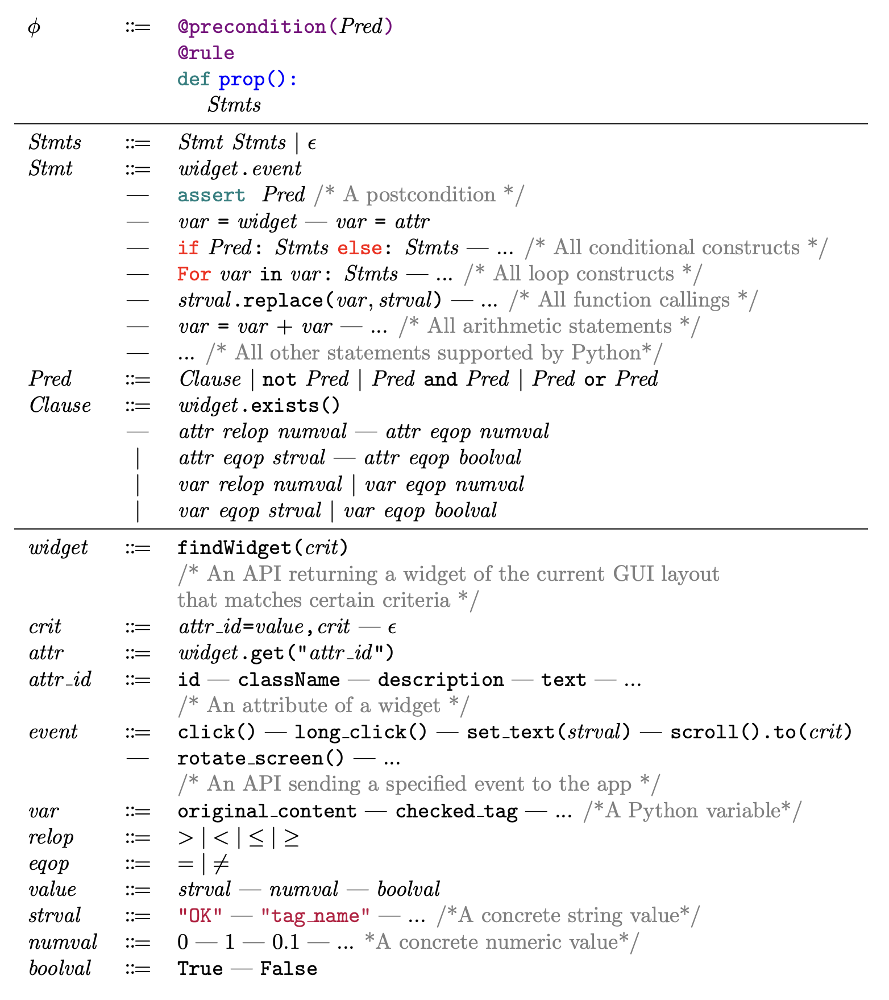

Property Description Language
==============================

|

To facilitate specifying general properties in the form of ``Φ = ⟨P, I, Q⟩``, Kea design a property description language (PDL).
It is a domain specific language based on Python. The figure above shows the core syntax of our PDL,
which is a superset of the syntax of Python. In our PDL, the interaction scenario **I** and the postcondition **Q** are specified in a Python function annotated with ``@property``.
The precondition **P** is specified in the function’s annotation ``@precondtion``.

In our language, the precondition is specified in the annotation ``@precondtion``, while the postcondition is specified in an assert statement. In the figure above,
The rule of ``Pred`` shows that a predicate could be a first-order clause ``Clause`` or a number of clauses
connected by logical operators (and, or, and not). A clause ``Clause`` can check
whether a specific widget exists on the current GUI layout or the value of a widget’s specific attribute (e.g., id, text).
To support more general predicates, our language provides an API named as ``widget`` to obtain a widget (from the current GUI layout) which matches some criterion crit.
The crit specifies the expected values of some attribute ``attr_id`` (e.g., id or text) of the obtained widget.

Following the syntax of Python, our PDL allows the users to define a sequence of statements as the interaction scenario.
In the figure above, the rule of event shows that our PDL supports generating and sending various events such as ``click()``, ``long_click()``, and ``rotate_screen()``.
Since our PDL is a superset of Python, the user can utilize all features in Python,
e.g., conditional statements, loops, and function calls, to facilitate specifying the interaction scenarios with complicated logic.

Moreover, as the rule of ``Stmts`` and  ``Stmt`` in the figure shows, our PDL allows users to specify multiple assert statements in the function body.
Assume a GUI state **S0** satisfies the precondition of a property ``Φ = ⟨P, I, Q⟩`` and the interaction scenario **I** yields a sequence of GUI states **[s0, s1, s2, s3]**.
Our PDL allows users to place the assert statements following any GUI state (say **S1**) to define the postcondition **Q**. In other words, **Q** is not limited to be placed after the ending state **S3**.
You can also use conditional statements, loops, and function calls to specify more complicated postconditions. The users can also specify multiple properties in the function body.

