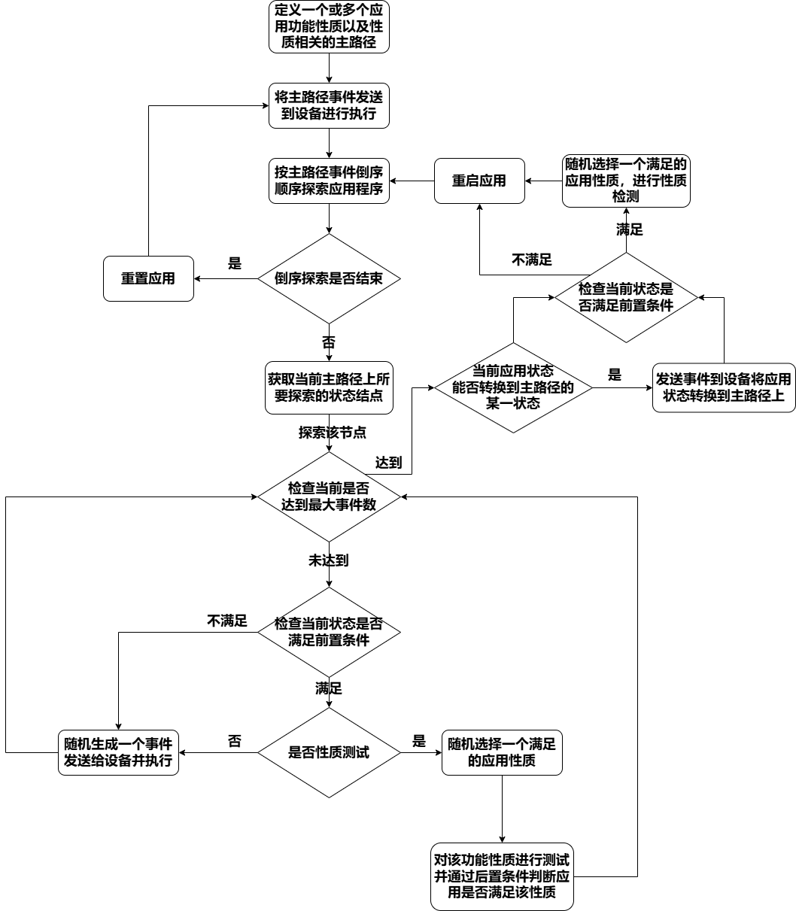
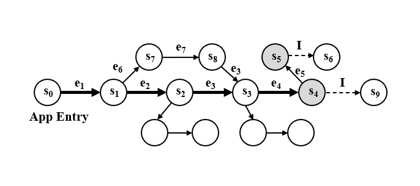

.. _main_path:

GuidedPolicy
================

GuidedPolicy类是主路径引导探索策略的核心类。
主要负责获取用户在定义性质时定义的主路径以及根据主路径引导探索策略生成输入事件。
该类提供了完整的主路径引导探索策略的事件生成过程引导方法。
GuidedPolicy所包含的主要方法有：

- 开始一段测试前从用户定义的主路径中随机选择一条主路径。
- 根据当前状态是否在主路径上决定返回事件种类。
- 在主路径上获取下一个执行的事件。
- 离开主路径探索应用深层状态过程的主要调控。
- 从主路径上获取能引导应用回到主路径上的事件。

主路径引导策略的介绍
--------------------

据观察，当用户指定应用程序性质时，用户通常沿着应用程序入口的主路径到达目标应用程序功能。这样的主要路径可以很容易地作为获得，并能够用于指导探索。
具体来说，当从应用程序入口执行主路径时，我们可以获得一系列GUI状态 :math:`S = [s_0,s_1,s_2,……,s_n]`, 其中 :math:`s_n \models P`，
即 :math:`s_n` 满足前置条件。此外，探索靠近主路径的状态可能会有更高的机会达到满足前提条件的 GUI 状态。本算法的核心执行流程如图。

    主路径引导探索策略的流程图

具体执行步骤如下：

步骤1：将主路径中的每个事件 :math: `e_i` 发送到被测移动应用，得到主路径的状态序列 :math:`S = [s_0,s_1,s_2,……,s_n]`，
从而使被测移动应用到达满足前置条件 :math:`P` 的状态 :math:`s_n`;

步骤2：判断是否达到最大测试执行时间，若达到则结束测试，否则按照 :math:`S = [s_0,s_1,s_2,……,s_n]` 倒序探索应用程序。
若 :math:`S` 中的所有状态被探索完毕，则初始化被测移动应用；否则，按倒序关系取出一个未被探索的状态 :math:`s_i`，
发送相应的前序事件序列 :math:`[e_1,e_2,……，e_i]`,使得被测移动应用到达主路径状态 :math:`s_i`,继续步骤3；

步骤3：以状态 :math:`s_i` 作为探索被测移动应用的起始状态，判断当前已执行事件个数是否达到最大执行事件个数，
如没有达到，获取当前被测移动应用状态，继续步骤4；如果达到，则执行6；

步骤4：判断当前被测移动应用状态是否满足一个或多个前置条件 :math:`P`。若没有任何前置条件满足或者不进行性质检测，
则继续执行步骤5；否则，执行交互场景 :math:`I` 中定义的事件序列，判断后置条件 :math:`Q` 是否满足，返回步骤3；

步骤5：使用外部用户界面交互工具分析当前界面状态获取可执行事件列表，从可以执行的事件列表中随机选择一项事件，
并发送给被测移动应用执行，返回步骤3；

步骤6：判断当前状态能否转换为状态 :math:`s_n`，若能，则发送相应的事件到被测移动应用，使得移动应用的状态满足前置条件；

为了更清晰的展示该策略的上述过程，在此通过下图进一步详析这一过程。

    主路径引导探索策略的实施例示意图

令 :math:`s_0` 为被测移动应用的起始探索状态，主路径为 :math:`E = [e_1,e_2,e_3,e_4]`，性质为 :math:`\phi = <P,I,Q>`。
在第一次迭代中，该策略将发送 :math: `E` 的所有事件并到达 :math:`s_4` 并且 :math:`s_4 \models P`。
满足 :math:`P` 的状态用灰色标记。然后本策略引导从 :math:`s_4` 开始随机探索。假设它在 :math:`s_4` 上生成 :math:`e_5` 并达到 :math:`s_5`。
假设 :math:`s_5 \models P`，策略可能决定执行 :math:`I` 获得结束状态 :math:`s_6` 并在该状态上检查后置条件 :math:`Q`。
假设 :math:`s_6 \models P`，则说明没有发现性质错误。此时，假设 :math:`e_5` 和 :math:`I` 的执行事件数量超过预先限定的最大事件数量，
策略将停止随机探索并尝试导航到满足 :math:`P` 的主路径。假设 :math:`E` 中的事件无法在 :math:`s_6` 上发送，则该策略会放弃引导过程，并开始第二次迭代。
在第二次和第三次迭代中，它将分别从 :math:`s_3` 和 :math:`s_2` 开始，并执行与第一次迭代类似的过程。在第 4 次迭代中，从 :math:`s_1` 开始。
假设过程中通过生成两个随机事件 :math:`e_6` 和 :math:`e_7` 来探索 :math:`s_1`，:math:`e_6 \to s_7`，:math:`e_7 \to s_8`，
但 :math:`s_7` 和 :math:`s_8` 都不满足前置条件 :math:`P`，则本策略尝试导航回遵循满足 :math:`P` 的主路径。假设过程中发现 :math:`e_3`
可以在 :math:`s_8` 上发送。它会依次发送 :math:`e_3` 和 :math:`e_4` 以尝试遵循主路径。假设最终到达满足 :math:`P` 的 :math:`s_4` 本策略将执行 :math:`I`
并在结束状态 :math:`s_9` 上检查后置条件 :math:`Q`。如果后置条件不成立，则表明发现一个功能性质错误。

步骤7：检查当前状态是否满足前置条件，若满足则进行性质测试；

步骤8：重启移动应用并返回步骤2。

默认参数
---------

- ``MAX_NUM_RESTARTS``: 最大重启次数。
- ``MAX_NUM_STEPS_OUTSIDE``: 应用外的最大步骤数。
- ``MAX_NUM_STEPS_OUTSIDE_KILL``: 应用外最大步骤数（强制终止）。
- ``START_TO_GENERATE_EVENT_IN_POLICY``: 策略中生成事件的起始时间。
- ``MAX_NUM_QUERY_LLM``: 最大查询 LLM 的次数。
- ``EVENT_FLAG_STARTED``: 事件开始标志。
- ``EVENT_FLAG_START_APP``: 启动应用的事件标志。
- ``EVENT_FLAG_STOP_APP``: 停止应用的事件标志。
- ``EVENT_FLAG_EXPLORE``: 探索事件标志。
- ``EVENT_FLAG_NAVIGATE``: 导航事件标志。
- ``EVENT_FLAG_TOUCH``: 触摸事件标志。
- ``POLICY_GUIDED``: 主路径引导策略名称。
- ``POLICY_RANDOM``: 随机策略名称。
- ``POLICY_LLM``: LLM 策略名称。
- ``POLICY_NONE``: 无策略名称。

GuidedPolicy类中的数据结构
---------------------------

1. **main_path**
   
    main_path是MainPath类的对象，是当前测试过程所选用的主路径。

2. **execute_main_path**
   
    execute_main_path为bool类型，用于记录当前界面状态是否在主路径上。用于根据不同情况生成不同事件。

3. **current_index_on_main_path**
   
    current_index_on_main_path整型，为当前所处主路径的事件节点编号。初始值为0。

4. **current_number_of_mutate_steps_on_single_node**
   
    current_number_of_mutate_steps_on_single_node整型，记录了已经在当前状态节点上探索生成事件的次数。初始值为0。

5. **max_number_of_mutate_steps_on_single_node**
   
    max_number_of_mutate_steps_on_single_node整型，记录了对单个状态节点最大探索生成事件的次数。初始值为20。

6. **number_of_events_that_try_to_find_event_on_main_path**
   
    number_of_events_that_try_to_find_event_on_main_path整型，记录了当前尝试回到主路径的次数。初始值为0。

7. **index_on_main_path_after_mutation**
   
    index_on_main_path_after_mutation整型，是对某个状态节点执行一系列事件探索后能够回到的主路径上的事件编号。初始值为-1。

8. **mutate_node_index_on_main_path**

    mutate_node_index_on_main_path整型，是记录当前所探索的主路径上的事件节点编号。初始值为所选主路径的长度。

主路径引导策略的伪代码
----------------------

:math:`\textbf{Algorithm:} Main Path Guided Exploration`

:math:`\textbf{Input:} \phi = <P,I,Q>,E=[e_1,e_2,……,e_n]`
    
:math:`\textbf{Output:} Bug Report`

.. code-block::
    :linenos:

    Function main (Φ = <P,I,Q>, E = [e1,e2,……,en])
        i ← n;
        while not timeout do
            if i > 0 then
                for e ← e1  to ei  do
                    sendEventToApp (e);
            explore(Φ,E)
            i ← i-1
            if i = -1 then
                cleanApp();
                i ← n;
            restartApp();
    Function explore (Φ = <P,I,Q>, E = [e1,e2,……,en])
        for t < 1 to MAX_STEP do
            s ← getCurrentState();
            if s ⊨ P ∧ random() < 0.5 then
                checkProperty(I,Q) ;
            else
                e ← generateRandomEvent (s);
                sendEventToApp(e);
        ej  ← canGoToSatisfyPrecondition(E);
        if ej  ≠ null then
            goToSatisfyPrecondition (e_j,E);
        s ← getCurrentState();
        if s ⊨ P then
            checkProperty (I,Q) ;
    Function canGoToSatisfyPrecondition (E = [e1,e2,……,en]):
        s ← getCurrentState();
        for ej  ← en  to e1  do
            if ej  ← en  to e1  then
                return ej;
         return null;
    Function goToSatisfyPrecondition(ej, E = [e_1,e_2,……,e_n]):
        for e ← ej  to en  do
            s ← getCurrentState();
            if e.widget ∈ s then
                sendEventToApp(e);

此策略采用输入一个性质 :math:`\phi = <P,I,Q>` 和事件序列 :math:`E = [e_1,e_2,……,e_n]` 形式的主路径。
该策略沿主路径向后遍历，并在接近主路径的范围内进行UI探索（第 3-12 行）。具体来说，
它从 :math:`e_n` 向后迭代到 :math:`e_1` （第 8 行）。对于 :math:`0 < i \leq n` 的每个事件 :math:`e_i`,
它会将前缀 :math:`[e_1,e_2,……,e_i]` 发送到应用程序，以达到主路径的 GUI 状态 :math:`s_i` （第 5-6 行）。
接下来，它探索接近 :math:`s_i` 的 GUI 状态，尝试找到满足前置条件 :math:`P` 的状态（第 7 行）。请注意，
在 :math:`s_1` 之后，本系统还通过不从 :math:`E` 发送任何事件来探索接近 :math:`s_0` 的 GUI 状态（第 4 行）。
如果时间预算允许，可以沿主路径进行多次遍历，我们在探索主路径上的每个状态（第 9-11 行）后清理应用程序数据。

从主路径的 GUI 状态开始的探索类似于前述随机探索策略（第 14-20 行）。具体来说，在每个 GUI 状态中，
本算法检查是否满足某个前置条件 :math:`P` （第 15-16 行）。如果有前置条件满足，本算法会有50%的概率来测试
:math:`s` 处的性质（第 16 行）。否则，将生成随机事件并发送给设备以达到另一个状态（第 19-20 行）。
上述过程迭代 :math:`MAX_STEP` 次（第 14 行）。

探索完之后，本算法尝试回到满足前提条件的状态（第 21-23 行）。因为从主路径的 GUI 状态开始的随机探索可能会改变应用程序的内部状态，
在这种情况下，达到满足前置条件的状态可能会进一步表现出不同的行为。为此，
本算法搜索可在当前 GUI 状态（第 28-32 行）发送的最接近事件 :math:`e_j`。如果 :math:`e_j` 存在，
我们尝试给设备发送发送 :math:`E` 的后缀 :math:`[e_j,e_j+1,……,e_n]` （第 34-37 行）。
最后尝试再次测试应用性质（第 24-26 行）。

GuidedPolicy类中的成员方法
---------------------------

.. note::
        
    为了便于读者理解，本文中提供的代码段简化版本仅对核心流程进行抽象并展示，实际代码与简化的参考代码不完全一致。

获取主路径的方法
~~~~~~~~~~~~~~~~~~~~~~~

1. **select_main_path**
   
   select_main_path从用户定义的所有主路径中随机选择一条作为本轮测试的引导路径。

   .. code-block:: python

        def select_main_path(self):
            if len(self.kea.all_mainPaths) == 0:
                self.logger.error("No mainPath")
                return
            self.main_path = random.choice(self.kea.all_mainPaths)
            self.path_func, self.main_path = self.main_path.function, self.main_path.path
            self.main_path_list = copy.deepcopy(self.main_path)
            self.max_number_of_events_that_try_to_find_event_on_main_path = min(10, len(self.main_path))
            self.mutate_node_index_on_main_path = len(self.main_path)

事件生成管理的成员方法
~~~~~~~~~~~~~~~~~~~~~~

1. **generate_event**
   
   根据当前应用状态判断应当生成事件的方法。如果在应用外则返回应用；如果在初始阶段则运行初始化函数；如果在执行主路径则返回主路径事件；
   如果在探索应用则返回继续探索所需事件。

   :参数: - 无

   :返回:
      - 一个生成的事件。

   .. code-block:: python

        def generate_event(self):
            current_state = self.from_state
            event = self.move_the_app_to_foreground_if_needed(current_state)
            if event is not None:
                return event
            if (self.event_count == START_TO_GENERATE_EVENT_IN_POLICY and self.current_index_on_main_path == 0) 
            or isinstance(self.last_event, ReInstallAppEvent):
                self.select_main_path()
                self.run_initializer()
                self.from_state = self.device.get_current_state()
            if self.execute_main_path:
                event_str = self.get_next_event_from_main_path()
                if event_str:
                    self.kea.execute_event_from_main_path(event_str)
                    return None
            if event is None:
                event = self.mutate_the_main_path()
            return event

在主路径上获取事件的成员方法
~~~~~~~~~~~~~~~~~~~~~~~~~~~~~~~~

1. **get_next_event_from_main_path**
   
   获取主路径上应该执行的下一个事件。

   :参数: - 无

   :返回: - 主路径上的下一个事件。

    .. code-block:: python

        def get_next_event_from_main_path(self):
            if self.current_index_on_main_path == self.mutate_node_index_on_main_path:
                self.execute_main_path = False
                return None
            u2_event_str = self.main_path_list[self.current_index_on_main_path]
            if u2_event_str is None:
                self.current_index_on_main_path += 1
                return self.get_next_event_from_main_path()
            self.current_index_on_main_path += 1
            return u2_event_str

应用状态探索过程的成员方法
~~~~~~~~~~~~~~~~~~~~~~~~~~~~~~~~

1. **mutate_the_main_path**
   
   根据当前事件执行次数判断是继续生成随机事件还是回到主路径上。
   
   :参数: - 无

   :返回:
      - 探索过后生成的事件。

   .. code-block:: python

        def mutate_the_main_path(self):
            event = None
            self.current_number_of_mutate_steps_on_single_node += 1
            if (self.current_number_of_mutate_steps_on_single_node >= self.max_number_of_mutate_steps_on_single_node):
                if (self.number_of_events_that_try_to_find_event_on_main_path <= self.max_number_of_events_that_try_to_find_event_on_main_path):
                    self.number_of_events_that_try_to_find_event_on_main_path += 1
                    if self.index_on_main_path_after_mutation == len(self.main_path_list):
                        rules_to_check = (self.kea.get_rules_whose_preconditions_are_satisfied())
                        if len(rules_to_check) > 0:
                            t = self.time_recoder.get_time_duration()
                            self.time_needed_to_satisfy_precondition.append(t)
                            self.check_rule_whose_precondition_are_satisfied()
                        return self.stop_mutation()
                    event_str = self.get_event_from_main_path()
                    try:
                        self.kea.execute_event_from_main_path(event_str)
                        return None
                    except Exception:
                        return self.stop_mutation()
                return self.stop_mutation()
            self.index_on_main_path_after_mutation = -1
            if len(self.kea.get_rules_whose_preconditions_are_satisfied()) > 0:
                self.check_rule_whose_precondition_are_satisfied()
                return None
            event = self.generate_random_event_based_on_current_state()
            return event

2. **generate_random_event_based_on_current_state**
   
   生成随机事件探索应用。
   
   :参数: - 无
   
   :返回: - 随机生成的事件。

    .. code-block:: python

        def generate_random_event_based_on_current_state(self):
            current_state = self.from_state
            event = self.move_the_app_to_foreground_if_needed(current_state)
            if event is not None:
                return event
            possible_events = current_state.get_possible_input()
            possible_events.append(KeyEvent(name="BACK"))
            possible_events.append(RotateDevice())
            self._event_trace += EVENT_FLAG_EXPLORE
            event = random.choice(possible_events)
            return event
        
3. **stop_mutation**
   
   停止探索过程，并重置参数。
   
   :参数: - 无
   
   :返回: - 重启或者重装应用事件。

    .. code-block:: python

        def stop_mutation(self):
            self.index_on_main_path_after_mutation = -1
            self.number_of_events_that_try_to_find_event_on_main_path = 0
            self.execute_main_path = True
            self.current_number_of_mutate_steps_on_single_node = 0
            self.current_index_on_main_path = 0
            self.mutate_node_index_on_main_path -= 1
            if self.mutate_node_index_on_main_path == -1:
                self.mutate_node_index_on_main_path = len(self.main_path)
                return ReInstallAppEvent(app=self.app)
            return KillAndRestartAppEvent(app=self.app)

从探索过程返回主路径的成员方法
~~~~~~~~~~~~~~~~~~~~~~~~~~~~~~~~

1. **get_event_from_main_path**
   
   根据当前是否已经回到主路径上，如果已经回到则执行完后续主路径事件，如果没回到主路径上则根据主路径事件序列倒叙尝试返回主路径。

   :参数: - 无

   :返回:
       - 主路径事件字符串。

   .. code-block:: python

        def get_event_from_main_path(self):
            if self.index_on_main_path_after_mutation == -1:
                for i in range(len(self.main_path_list) - 1, -1, -1):
                    event_str = self.main_path_list[i]
                    ui_elements_dict = self.get_ui_element_dict(event_str)
                    current_state = self.from_state
                    view = current_state.get_view_by_attribute(ui_elements_dict)
                    if view is None:
                        continue
                    self.index_on_main_path_after_mutation = i + 1
                    return event_str
            else:
                event_str = self.main_path_list[self.index_on_main_path_after_mutation]
                ui_elements_dict = self.get_ui_element_dict(event_str)
                current_state = self.from_state
                view = current_state.get_view_by_attribute(ui_elements_dict)
                if view is None:
                    return None
                self.index_on_main_path_after_mutation += 1
                return event_str
            return None

2. **get_ui_element_dict**
   
   获取主路径上单个事件所操作的组件的相关信息。
   
   :参数:
      - ui_element_str: 组件信息字符串
   
   :返回: - 字典形式的该组件相关信息。

    .. code-block:: python

        def get_ui_element_dict(self, ui_element_str: str) -> Dict[str, str]:
            start_index = ui_element_str.find("(") + 1
            end_index = ui_element_str.find(")", start_index)
            if start_index != -1 and end_index != -1:
                ui_element_str = ui_element_str[start_index:end_index]
            ui_elements = ui_element_str.split(",")
            ui_elements_dict = {}
            for ui_element in ui_elements:
                attribute_name, attribute_value = ui_element.split("=")
                attribute_name = attribute_name.strip()
                attribute_value = attribute_value.strip()
                attribute_value = attribute_value.strip('"')
                ui_elements_dict[attribute_name] = attribute_value
            return ui_elements_dict

