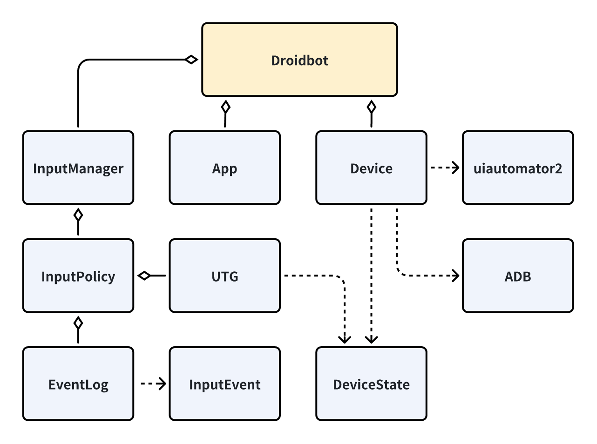

DroidBot
====================

DroidBot是kea在应用探索阶段与安卓设备交互的类。主要提供生成事件，截图等方法。DroidBot同时提供一个UTG(UI Transition Graph, 事件迁移图)。
可以基于事件迁移图，以基于模型的测试(MBT, Model Based Testing)编写更高级的应用探索策略。

.. note:: 

    Droidbot为本项目的参考项目。

    https://github.com/honeynet/droidbot

Droidbot项目架构
~~~~~~~~~~~~~~~~~~~~~~~~~~

Droidbot项目架构组成部分有：

1. App： 用于解析安卓应用安装包(.hap)或安卓包(package)。提供EntryActivity等信息。
2. Device： 一个安卓设备的抽象，提供设备层面的一些操作接口，如发送文件，输入内容，旋转设备，获取前台应用等。
3. ADB： 安卓设备adb指令的抽象，提供通过adb与设备交互的接口，如shell，pull_file等。Device依赖于本类。
4. uiautomator2： 安卓设备测试工具uiautomator2，为Droidbot拓展提供输入事件等功能。
5. InputManager： 输入控制器，提供策略选择等功能。
6. InputPolicy： 输入策略，提供多种输入策略，如随机策略，大模型指引策略等，用于规定探索应用的规则。
7. EventLog： 事件日志的抽象，执行事件输入前，事件输入后的记录操作，以及发送事件的操作。
8. InputEvent： 输入事件的类，包含点击、长按、输入等事件。
9.  UTG： 事件迁移图(UI Transition Graph)的类，用于应用建模，可以被输入策略使用进行更复杂的决策。
10. DeviceState： 用于应用界面抽象的类，对应用界面进行不同层次的抽象，提供给UTG类进行建模。

因为InputManager, InputPolicy与Kea的输入策略重点相关，故另开章节进行介绍。uiautomator2为参考的框架，未做开发修改。
其他功能基本沿用原来的Droidbot。故在本节不介绍，重要的类会在团队参考Droidbot开发的鸿蒙版Droidbot：HMDroidbot中介绍。
    

    Droidbot 架构图