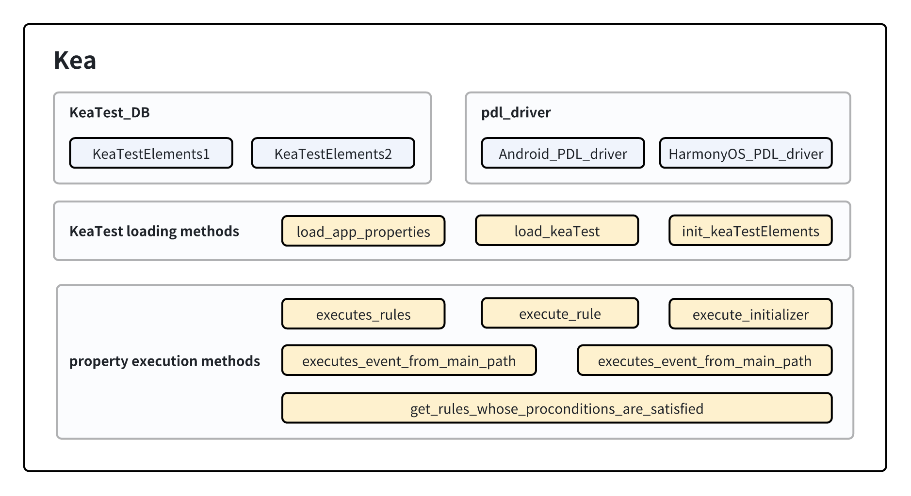

Kea
===========================

本部分旨在解释 Kea 的中的核心控制器类 Kea 的设计与实现。

功能设计与实现
----------------------------------

Kea类是工具中的核心类，为工具中与基于性质测试相关功能的控制器。在Kea类中，存储的内容和对外暴露的方法主要有：

- 加载所有KeaTest并读取至KeaTest至KeaTestElements的相关方法。
- 存储用户定义的所有KeaTestElements。以及访问这些性质相关函数(initializer, rule, mainPath)的方法。
- 存储当前运行的PDL驱动（含安卓与鸿蒙系统）。以及设置当前要运行的PDL驱动的方法。
- 性质的前置条件检查器方法，返回当前应用界面中通过了前置条件的性质。
- 执行一条性质的交互场景的方法。
- 执行主路径步骤的方法。

    Kea 类的组成

Kea类中的数据结构实现
-----------------------

1. **KeaTest_DB**
   
   KeaTest_DB是Kea运行时的数据库，用于存储所有的用户自定义性质。每个数据项以 <keaTest, keaTestElements> 
   的键值对方式存储。

2. **pdl_driver**

   pdl_driver 存储的是当前的 PDL (Property Description Languague, 性质描述语言) 的驱动。
   此处存储的是鸿蒙或安卓设备的驱动，主要用于执行主路径中的某一步。

Kea类中的成员方法实现
-------------------------

读取性质的相关方法
~~~~~~~~~~~~~~~~~~~~~~~~~

读取性质的相关方法主要对外提供读取用户自定义相关性质的方法。这些性质被读取后会按keaTestElements数据结构的方式组织，
并存储进入KeaTest_DB。

1. **load_app_properties**

load_app_properties 从用户指定的性质文件中读取性质并存储入Kea，其核心流程如下。

.. code-block:: 

    1. 去除重复指定的文件。
    2. 对每个文件，检查文件的后缀名是否为.py以确认文件有效性。
    3. 通过导入模块的方式导入用户定义的性质。
    4. 为模块设置对应的系统的pdl_driver。
    5. 检查在步骤3中获得的模块的成员，识别其中的用户定义性质（KeaTest的子类对象）并调用load_KeaTest方法加载他们。
    6. 回到步骤2直至所有用户自定义文件被加载完毕。

具体步骤的简化的python风格代码如下：

*注：为了描述清晰，简化的代码仅对核心流程进行抽象并展示，实际代码与简化的参考代码不完全一致。
下文将展示的其他简化代码遵循的规则相同。*

:参数: 
    - ``property_files:List[str]`` : 用户自定义性质的文件路径列表

:返回:
    - 无

.. code-block:: python

    @classmethod
    def load_app_properties(cls, property_files):

        remove_duplicated_files(property_files)

        for file in property_files:

            check_file_basename(file)

            module = get_module_name(file)
            
            try:
                module = importlib.import_module(module_name)

                # set the pdl driver in the modules
                module.d = cls._pdl_driver

                # find all kea tests in the module. Load them.
                for obj in getmembers(module):
                    if is_subclass(obj, KeaTest):
                        cls.load_KeaTest(obj)

1. **load_KeaTest**
   
load_KeaTest 从 KeaTest 中取出用户自定义的性质（含初始化函数对象、交互场景、主路径函数对象），
转换为 KeaTestElements 数据结构并存储入 KeaTest_DB 。

load_KeaTest 的流程如下：

.. code-block:: 

   1. 初始化一个KeaTestElements，以 <KeaTest, KeaTestElements> 数据项的方式存储进KeaTest_DB
   2. 调用KeaTestElements的方法读取KeaTest中的性质，并存储进KeaTestElements。

其实现通过简化的python代码展示如下：

:参数: 
    - ``keaTest:KeaTest`` : 用户自定义性质的keaTest对象

:返回:
    - ``keaTestElements:KeaTestElements`` : 读取了keaTest对象的keaTestElements对象

.. code-block:: python

    @classmethod
    def init_KeaTestElements(cls, keaTest):

        keaTest_name = get_keaTest_name(keaTest)
        keaTestElements = KeaTestElements(keaTest_name)
        KeaTest_DB.add_item(keaTest, KeaTestElements)
        return keaTestElements 

    @classmethod
    def load_KeaTest(cls, keaTest):

        keaTestElements = cls.init_KeaTestElements(keaTest)
        keaTestElements.load_initializers(keaTest)        
        keaTestElements.load_rules(keaTest)
        keaTestElements.load_mainPaths(keaTest)

性质执行相关方法
~~~~~~~~~~~~~~~~~~~~~~~

性质执行的相关方法主要对外提供与性质执行相关功能的接口，主要交由输入策略调用。如获取当前页面通过前置条件的性质，
执行一条性质的交互场景等。

1. **execute_rules**
   
对一组rules(性质)，随机选择一条性质并调用execute_rule方法尝试执行之。

其python风格的简化代码定义实现如下。

:参数: 
    - ``rules:List[Rule]`` : 性质交互场景列表

:返回:
    - 执行结果

.. code-block:: python

    def execute_rules(rules):

        if rules is empty:
            return CHECK_RESULT.PRECON_NOT_SATISFIED
        rule_to_check = random.choice(rules)
        execute_rule(rule_to_check)

1. **execute_rule**

对于一条rule(性质)，执行之并返回执行结果。其返回的结果CHECK_RESULT是一个结构体常量，如下为它的五种返回情况及其含义：

.. code-block:: 

    1. PRECOND_NOT_SATISFIED  前置条件不满足，一般由于页面不稳定引起
    2. Ui_NOT_FOUND           找不到执行过程中某一步骤的控件
    3. ASSERTION_FAILURE      断言（后置条件）失败，找到疑似应用错误
    4. UNKNOWN_EXECPTION      未知的错误
    5. PASS                   断言（后置条件）成功，性质通过

其python风格的简化代码实现如下。

:参数: 
    - ``rules:List[Rule]`` : 性质交互场景列表

:返回:
    - ``CHECK_RESULT``: 执行结果

.. code-block:: python

    def execute_rule(rule, keaTest):

        if precondition_satisfied(rule) == False:
            return CHECK_RESULT.PRECON_NOT_SATISFIED
        try:
            execute(rule.function(keaTest))
        except UiObjectNotFoundError:
            return CHECK_RESULT.UI_NOT_FOUND
        except AssertionError:
            return CHECK_RESULT.ASSERTION_FAILURE
        except Exception:
            return CHECK_RESULT.UNKNOWN_EXECPTION

        return CHECK_RESULT.PASS

1. **get_rules_whose_preconditions_are_satisfied**

对于一组性质，检查他们的前置条件，并获取通过前置条件的性质。

其python风格的简化代码如下：

:参数: 
    - 无

:返回:
    - ``rules_passed_precondition:Dict[Rule, KeaTest]``: 通过了前置条件的性质列表

.. code-block:: python

    def get_rules_whose_preconditions_are_satisfied():
        
        for keaTestElements in KeaTest_DB:
            for target_rule in keaTestElements:
                if pass_precondition(target_rule) == True
                    rules_passed_precondition.add(target_rule)

        return rules_passed_precondition

4. **get_rules_without_precondition**

对于一组性质，若他们的前置条件，并获取无前置条件的性质。

.. note:: 
    无前置条件的性质被视为无条件执行，等价于前置条件恒成立。

其python风格的简化代码如下：

:参数: 
    - 无

:返回:
    - ``rules_passed_precondition:Dict[Rule, KeaTest]``: 无前置条件的性质列表
   
.. code-block:: python

    def get_rules_without_preconditions(self):

        for eaTestElements in KeaTest_DB:
            for target_rule in keaTestElements.rules:
                if len(target_rule.preconditions) == 0:
                    rules_without_precondition.add(target_rule)
        return rules_without_precondition

5. **execute_event_from_main_path**

对于给定的一个主路径步骤的源代码，尝试执行之。因为主路径中是用户利用PDL驱动编写的步骤，
因此需要获取驱动对象，并让其执行相应操作。驱动储存在前述数据结构的pdl_driver中。

其python代码如下。

:参数: 
    - ``executable_script:str`` : 可执行的主路径步骤源代码

:返回:
    - 无

.. code-block:: python

    def execute_event_from_main_path(self, executable_script):
        d = self._pdl_driver
        exec(executable_script)