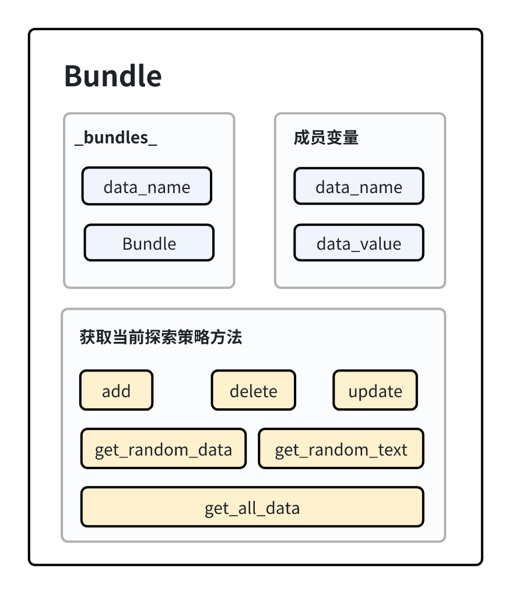

带状态的测试
================

本部分旨在解释 Kea 的带状态的测试是如何设计及实现的

功能说明与功能设计
~~~~~~~~~~~~~~~~~~~~~~~~

Bundle类是带状态测试的核心类。
主要负责记录多组不同类型数据的相关状态和操作的组合，用于测试系统在不同状态下的行为。
该类提供了完整的成员方法用于状态的增删改查操作。
Bundle所包含的主要方法有：

- 根据当前类型数据的状态情况判断是否需要新增状态（单例模式）。
- 对某类型数据状态的增删改查。
- 随机生成指定长度的状态文本值。
- 随机获取某类型数据的一个状态。
  

    Bundle 类的组成

Bundle类中的数据结构的实现
---------------------------

1. **_bundle_**

    _bundle_为Bundle的类变量，是带状态测试中各种类型数据的状态记录库，用于存储应用状态便于对状态的操作。
    每个数据项以 <string, Bundle> 的键值对方式存储。

2. **data_name**

    data_name为string类型，存储了一个类型的数据的名称。

3. **data_value**
   
   data_value是list类型，存储了该类型的数据的所有状态。

.. note::
        
    为了便于读者理解，本文中提供的代码段简化版本仅对核心流程进行抽象并展示，实际代码与简化的参考代码不完全一致。

Bundle类中功能方法的实现
-----------------------------

单例模式方法
~~~~~~~~~~~~~~~~~~~~

1. **__new__**

   根据当前类型数据的名称判断是否已经实例化过该类型数据的Bundle对象，若没有实例化则实例化该类型Bundle对象并返回。
   否则，不实例化并返回之前实例化的对象。

    :参数:
       - ``data_name``: 想要实例化的某个类型数据名称。
  
    :返回:
      - 该类型数据的实例。
  
    .. code-block:: python

        def __new__(cls, data_name: str = None):
            if data_name in cls._bundles_:
                return cls._bundles_[data_name]
            else:
                instance = super().__new__(cls)
                cls._bundles_[data_name] = instance
                return instance

数据状态增删改查的成员方法
~~~~~~~~~~~~~~~~~~~~~~~~~~~~~~

1. **add**
   
    为当前类型数据增加状态。

    :参数:
       - ``value``: 新增的状态值。
  
    .. code-block:: python

        def add(self, value = None):
            if value is None:
                raise ValueError("the value of " + self.data_name + " cannot be None")
            self.data_value.append(value)

2. **delete**
   
    为当前类型数据删除状态。

    :参数:
       - ``value``: 要删除的状态值。

    .. code-block:: python

        def delete(self, value = None):
            if value is None:
                raise ValueError("the value of " + self.data_name + " cannot be None")
            self.data_value.remove(value)

3. **update**
   
    为当前类型数据更新状态。

    :参数:
       - ``value``: 要修改的旧状态值。    
       - ``new_value``: 新的状态值。
  
    .. code-block:: python

        def update(self, value = None, new_value = None):
            if new_value is None:
                raise ValueError("the new name of " + self.data_name + " cannot be None")
            if value is None:
                raise ValueError("the old name of " + self.data_name + " cannot be None")
            try:
                self.data_value.remove(value)
                self.data_value.append(new_value)
            except KeyError:
                print(f"'{value}' is not a object of Bundle.")

4. **get_all_data**
   
    获取该类型数据的所有状态。

    :返回:
        1. 状态列表
   
    .. code-block:: python

        def get_all_data(self):
            return self.data_value

随机生成状态文本的成员方法
~~~~~~~~~~~~~~~~~~~~~~~~~~~~~

1. **get_random_text**
   
    随机生成指定长度的状态文本值。

    :参数:
        - ``value_max_len``: 需要状态文本值的最大长度。

    :返回:
        1. 合法的状态文本值

    .. code-block:: python

        def get_random_text(self, value_max_len = 10):
            text = st.text(alphabet=string.ascii_letters, min_size=1, max_size=value_max_len).example()
            return text

随机获取一个状态的成员方法
~~~~~~~~~~~~~~~~~~~~~~~~~~~~~~~

1. **get_random_data**

    随机获取某类型数据的一个状态。

    :返回:
        1. 该类型数据的一个状态值

    .. code-block:: python

        def get_random_data(self):
            random_item = random.choice(self.data_value)
            return random_item