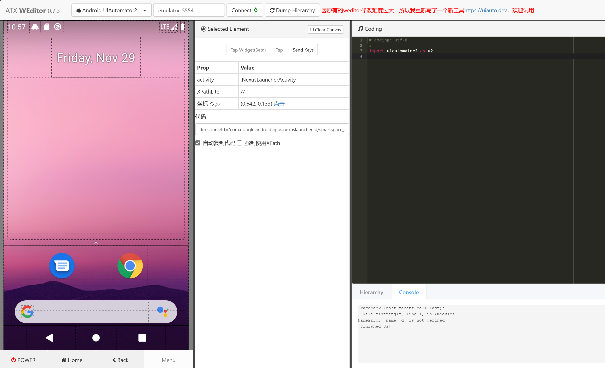
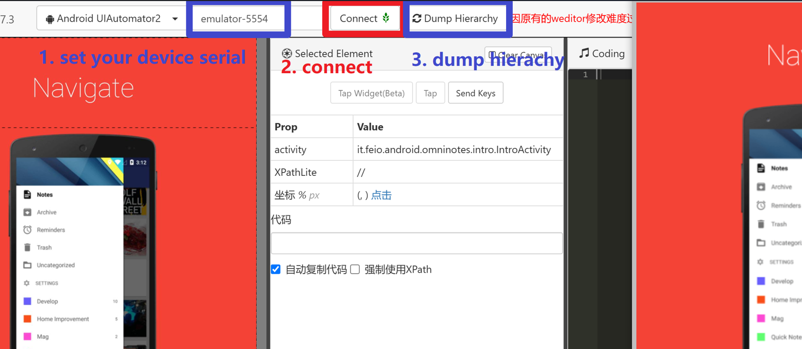
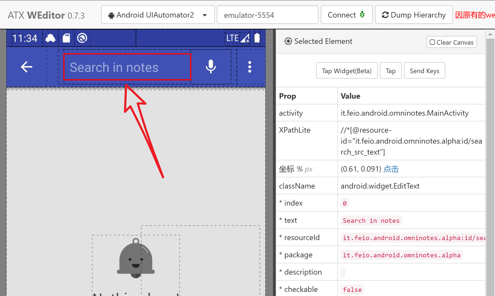

编写第一个性质
======================================

检查环境
--------------------------------------

Kea 是一个基于性质的移动应用测试框架，目前支持 Android 和 HarmonyOS。请确保你拥有一台移动设备，并在你的电脑上安装了 Android/HarmonyOS 命令行工具。检查 ``adb`` （Android）或 ``hdc`` （HarmonyOS）是否可用。  

- 如果你没有真机，可以通过模拟器使用 Kea。

- 请确保你已安装 ``python 3.8+``。  

安装
--------------------------------------
使用以下命令安装Kea

.. code-block:: console

    git clone https://github.com/ecnusse/Kea.git
    cd Kea
    pip install -e .

输入 ``kea -h`` 以检查 Kea 是否已成功安装。

编写第一个性质(安卓)
--------------------------------------

启动你的设备或 Android 模拟器。在终端中输入 ``adb devices`` 以确保它可用。

我们将使用 `weditor <https://github.com/alibaba/web-editor>`_ 来检查 Android 元素并编写性质。

**1. 启动 weditor 并安装你的应用。**

.. code-block:: bash 

    pip install weditor==0.7.3
    python -m weditor

上述命令将在你的电脑上安装 weditor 并启动它。它提供了一个主机服务器（默认：http://localhost:17310）。你可以在网页浏览器中访问它。

    weditor 的主页。

然后，进入 kea 工作区并安装应用 omninotes。

.. code-block:: bash

    adb install example/omninotes.apk

检查应用是否已成功安装。

**2. Dump hierachy并检查 Android 元素**

在 weditor 中Dump hierachy以获取 Android 元素。

:guilabel:`输入设备序列号` -> :guilabel:`Connect` -> :guilabel:`Dump hierachy`

    从 weditor Dump hierachy

连接到 weditor 后，你可以点击 :guilabel:`Dump hierachy` 来刷新元素（即Dump hierachy），每当你的屏幕发生变化时。  
或者，你可以启用自动Dump hierachy，以避免手动刷新元素。

你可以点击一个元素并检查其属性。

**3. 编写你的第一个性质**

我们在这个应用中有一个简单的功能需要检查：**旋转后搜索输入框不应被清空。**

现在，让我们编写前置条件。这应该是功能开始时的唯一特征。我们想检查搜索输入框，所以让我们先移动到搜索功能。通过点击 :guilabel:`搜索` 按钮，你可以进入搜索编辑页面。显然，这个页面的唯一特征应该是搜索输入框本身。

**在 weditor 中Dump hierachy。点击搜索框以检查其属性。**

    在 weditor 中检查一个控件

我们需要特定于控件的属性来定位一个控件。最常用的唯一属性是 **resourceId**。  
如果没有 **resourceId**，**text** 或 **className** 也可以，但大多数情况下它们不是唯一的，会导致错误。

因此，为了避免 kea 进入错误状态，你可以使用多个属性在选择器中定位一个控件，并使用多个控件定位一个页面。

**经过检查，我们知道搜索输入框的 resourceId。我们可以用以下命令来定位它。**

``d(resourceId="it.feio.android.omninotes.alpha:id/search_src_text")``

.. note:: 

    你可能会对 ``d(**选择器)`` 脚本感到困惑。这是 kea 的 PDL（Property Description Language, 性质描述语言）  
    用于与 AUT（被测应用）交互。你可以阅读 :ref:`pdl_api` 以获取详细信息。

**要检查这个控件是否存在，我们调用 ``exists``。**

``d(resourceId="it.feio.android.omninotes.alpha:id/search_src_text").exists()``

.. hint:: 
    双击 weditor 中的控件。这将自动为你生成 **click** 的动作脚本。  
    你可以参考它来编写自己的脚本。

**编写交互场景（即功能的作用）。**

我们需要旋转设备。从竖屏状态到横屏，再回到竖屏状态。脚本可以这样编写：
``d.rotate('l')``  
``d.rotate('n')``

**编写后置条件。旋转后输入框仍然应该存在。我们使用断言来确认它的存在。**

``assert d(resourceId="it.feio.android.omninotes.alpha:id/search_src_text").exists()``

恭喜！你已经编写了你的第一个性质！

**4. 使用 Kea API 封装你的性质**

在 kea 的根目录下创建一个 Python 文件 **my_prop.py**。

.. code-block:: python

    #my_prop.py
    from kea import *

    class CheckSearchBox(KeaTest):
        @precondition(lambda self: d(resourceId="it.feio.android.omninotes.alpha:id/search_src_text").exists())
        @rule()
        def search_box_should_exist_after_rotation(self):
            d.rotate('l')
            d.rotate('n')
            assert d(resourceId="it.feio.android.omninotes.alpha:id/search_src_text").exists()
    

启动 kea 并检查你的性质  
--------------------------------------

通过以下命令启动 kea。

.. code-block:: bash

    kea -f my_prop.py -a example/omninotes.apk -o output

检查 ``output/bug_report.html`` 中的错误报告。你可以在本教程中学习如何阅读错误报告： :ref:`bug_report_tutorial`。