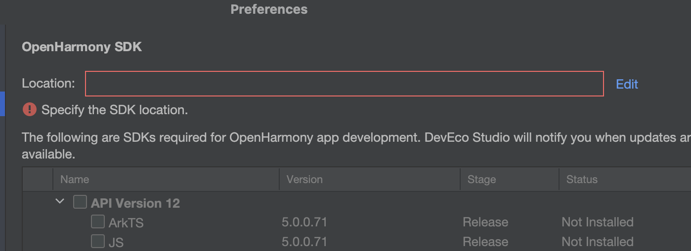
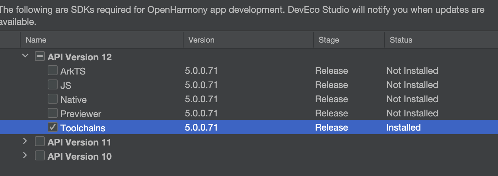
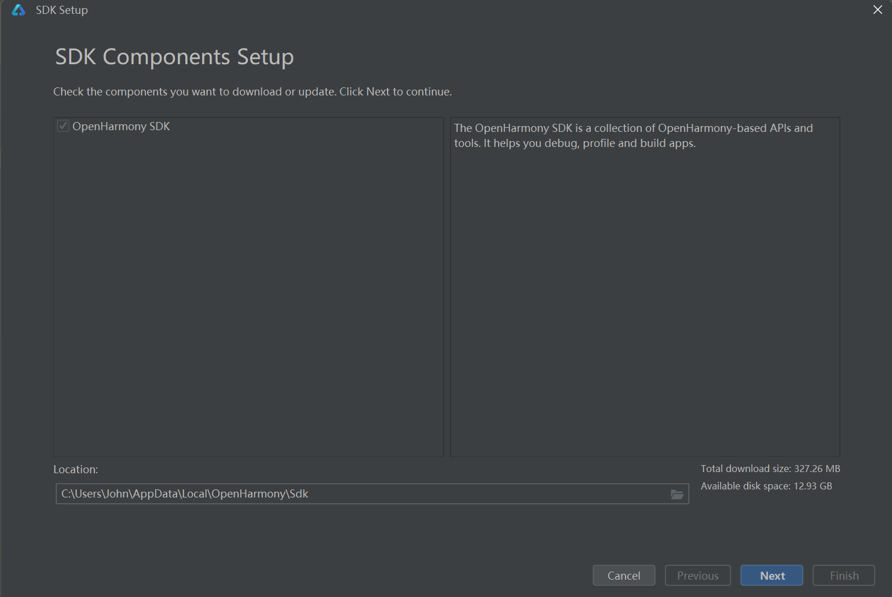

配置 HarmonyOS 环境
=======================================

.. tip:: 

   本节目标

   **1. 让 `hdc` 命令可用**
   
   Kea 依赖 hdc 命令与鸿蒙设备进行交互。关键是将 hdc 添加到 PATH 环境变量中。

   **2. 连接真机或使用模拟器**

1. 安装 DevEco Studio
~~~~~~~~~~~~~~~~~~~~~~~~~~~~~~~~~~~
下载并安装 DevEco Studio: `下载 DevEco Studio <https://developer.huawei.com/consumer/cn/deveco-studio/>`_.

2. 安装并配置 HarmonyOS SDK
~~~~~~~~~~~~~~~~~~~~~~~~~~~~~~~~~~~~
打开 DevEco Studio， 安装 HamonyOS SDK :guilabel:`DevEco Studio` -> :guilabel:`preferences` -> :guilabel:`OpenHarmony SDK`.

   在 DevEco Studio 中设置 SDK

点击 :guilabel:`edit`。设置你的 SDK 路径并安装 OpenHarmony SDK 工具链。API 版本应为 12+（5.0+）。

   下载 toolchains (API 12+)

添加sdk toolchains到环境变量

MacOS 和 Linux
-----------------------------

.. code-block:: bash

   # macOS and Linux
   export HARMONY_SDK_HOME="<Your path to opensdk home>"
   export PATH="$HARMONY_SDK_HOME/12/toolchains"

``source`` shell的配置文件以激活修改。

Windows 系统
-----------------------------

在你的电脑上安装了 DevEco Studio。你需要做的是将其工具目录添加至 PATH 变量，以便令SDK命令后工具在终端中生效。

如果你使用的是 zsh 或 bash，请使用 ``EXPORT`` 命令设置 ``HARMONY_SDK_HOME`` 环境变量。``HARMONY_SDK_HOMEE`` 
环境变量应指向你的 SDK 安装路径。默认路径是 ``C:\Users\usr_name\AppData\Local\OpenHarmony\Sdk``。你可以通过 :guilabel:`File` -> :guilabel:`Settings` -> :guilabel:`OpenHarmony SDK` -> :guilabel:`Edit` 查看你的安装路径。

    DevEco Studio 中 HamonyOS SDK 路径的示例

然后，将以下路径添加到 PATH 变量中。请参见 `Windows 系统中如何添加 PATH 环境变量 <https://helpdeskgeek.com/windows-10/add-windows-path-environment-variable/>`_。

.. code-block:: bash

   # Windows
   HARMONY_SDK_HOME: "<Your path to opensdk home>"
   PATH: %HARMONY_SDK_HOME%\12\toolchains

.. important::
   在终端中运行 ``hdc``， 查看命令是否可用。

3. 运行一个模拟器
~~~~~~~~~~~~~~~~~~~~~~~~~~~~~~~~~~

根据此指南运行一个模拟器： `管理及运行模拟器 <https://developer.huawei.com/consumer/cn/doc/harmonyos-guides-V13/ide-emulator-management-V13>`_ 

.. important::
   在终端中运行 ``hdc list targets``。 你可以看到模拟器以一个环回地址套接字(127.0.0.1:port)的形式提供。
