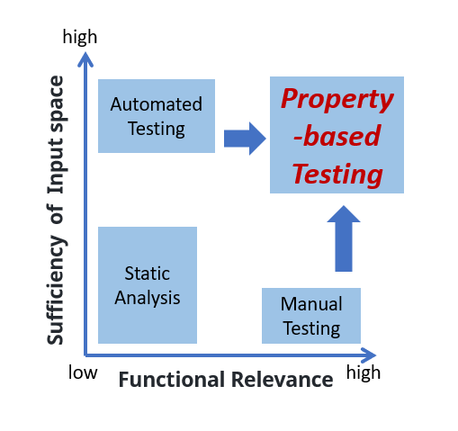

Advantages of Kea
====================================

.. note::
    According to the image above, you may know that the input space coverage and functional relevance of static analysis are both low.
    Manual testing focuses on functional relevance but still has low input space coverage.
    while automated testing, on the other hand, achieves high input space coverage but has lower functional relevance.
    Kea aims to enhance both functional relevance and input space coverage simultaneously based on Property-Based Testing (PBT).

Here list some advantages of Kea to help you know Kea more clearly.

1. Kea introduces a general and practical testing technique based on property-based testing.
2. Kea has low maintenance cost, compared to UI test.
3. Kea is powerful in detecting functional bugs in mobile apps.

