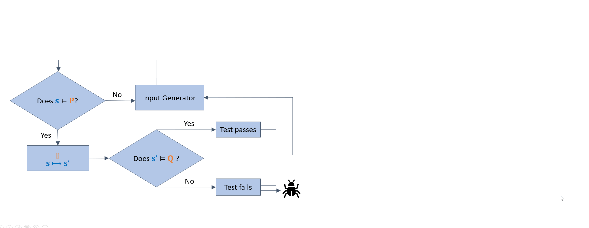
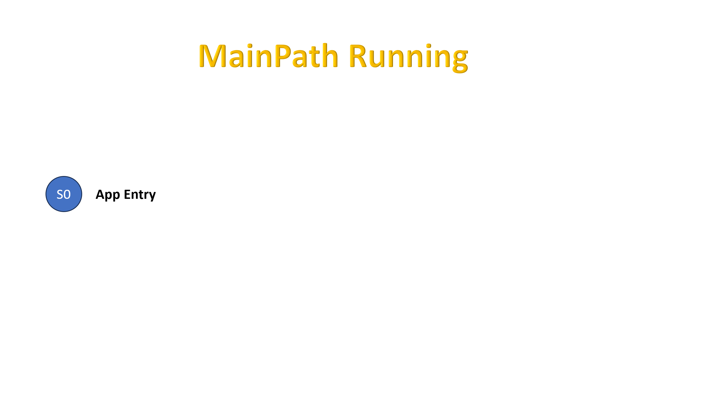

.. _kea_mechanism:

How It Works
========================

|

The core process of Kea is showed in the gif above. Following is some procedure details:

1. Analyze the functional characteristics and testing objectives of the mobile application under test.
Use the special property description language to define the set of functional properties of the mobile application under test.
Each functional property includes preconditions ``P``, interaction scenarios ``I``, and postconditions ``Q``.

2. Set the maximum test execution duration and the maximum number of execution events.
Choose an exploration strategy. If the random exploration strategy is selected, proceed to Step 3;
if the main path guiding strategy is selected, define a user event sequence as the main path based on the preconditions ``P``,
and continue to Step 4.

3. Kea use the random exploration strategy to generate an event sequence, perform property detection,
and record the corresponding test results and user interface screenshots until the maximum test execution time is reached.
Proceed to Step 5.

4. Kea use the main path guiding strategy(the details are showed in the gif below) to generate an event sequence, perform property detection,
and record the corresponding test results and user interface screenshots until the maximum test execution time is reached. Proceed to Step 5.

5. Based on the test results and user interface screenshots,
Kea automatically generate a bug report for the mobile application under test.