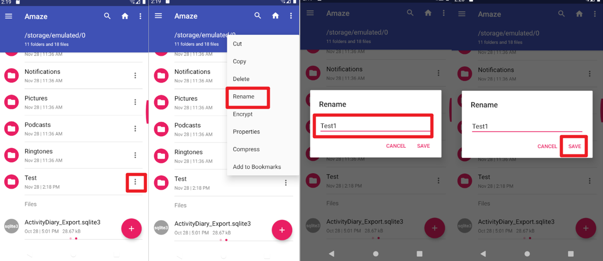
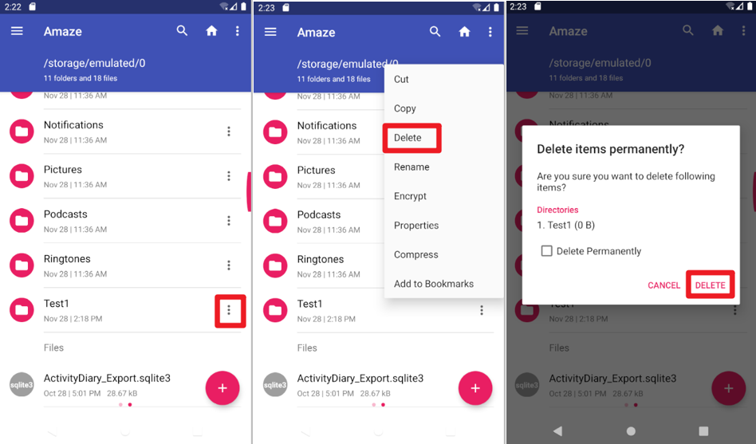

Stateful Testing
========================

Stateful Testing is a software testing method that primarily focuses on the behavior of a system in different states and the transitions between those states.
Its principle lies in tracking the current state of the system to verify how input operations affect the system's output and state changes.
This method is widely applied in scenarios that require state management, such as user interfaces and database transactions.
By designing state-based test cases, it ensures that the system functions correctly across various states, enhancing the reliability of the software and the user experience.

In mobile apps, some functionalities can move from one state to another state based on certain inputs or actions.
Thus, it need additional data structure to support this.

| Here Kea refers to `Hypothesis's Stateful Testing <https://hypothesis.readthedocs.io/en/latest/stateful.html>`_.

In Kea, you can use stateful testing when you write some properties that require stateful information.
Just like following codes, when you want to manipulate files or folders on devices, such us create a file, delete a file or rename the file.

.. code:: Python

    _files = Kea.set_bundle("files")

The Bundle class contains the following functions:

* add(value: str)

Add a new value to the current Bundle object.

.. code-block:: Python

    self._files.add(file_name)

* delete(value: str)

Delete a value from the current Bundle object.

.. code-block:: Python

    self._files.delete(selected_file_name)

* update(value: str, new_value: str)

Update the value from ``value`` to ``new_value``

.. code-block:: Python

    self._files.update(file_name, new_name)

* get_all_data()

This function will return a list of values of current Bundle object.

.. code-block:: Python

    self._files.get_all_data()

* get_random_value(value_len: int = 10)

This function will randomly generate a value and return. So you can call it before using the ``add`` and ``update`` function.

.. code-block:: Python

    file_name = self._files.get_random_value()
    self._files.add(file_name)

* get_random_data()

This function will randomly select a value from the existing values in the current Bundle object.
So you can call it before using the ``delete`` and ``update`` function.

.. code-block:: Python

    file_name = self._files.get_random_data()
    self._files.delete(selected_file_name)

Here is a complete example to show how to use Kea's stateful testing when you define property.
This example will show how to use stateful testing in the app `Amaze <https://github.com/TeamAmaze/AmazeFileManager>`_, it is a file management app,
allows users to manipulate files or folders on devices. These properties are defined for testing whether data manipulation of
the file system have some errors. Stateful testing is essential in this situation, you can use stateful testing to store all the folders created by Kea,
and can manipulate them along the whole testing process.

Firstly, you can define a ``create_file_should_exist`` property. Just return to the home directory, create a file and check whether the new file is exist.

.. image:: ../../images/CreateFile.png
            :align: center

|

.. code-block:: Python

        @precondition(lambda self: d(resourceId="com.amaze.filemanager:id/sd_main_fab").exists())
        @rule()
        def create_file_should_exist(self):
            d(resourceId="com.amaze.filemanager:id/pathbar").click()
            d(resourceId="com.amaze.filemanager:id/lin").child(index = 7).click()
            d(description="Navigate up").click()
            d(resourceId="com.amaze.filemanager:id/design_menu_item_text", textContains="Internal Storage").click()
            d(resourceId="com.amaze.filemanager:id/sd_main_fab").click()
            d(resourceId="com.amaze.filemanager:id/sd_label", text="Folder").click()
            file_name = self._files.get_random_value()
            d.send_keys(file_name, clear=True)
            d(resourceId="com.amaze.filemanager:id/md_buttonDefaultPositive").click()
            self._files.add(file_name)
            d(scrollable=True).scroll.to(resourceId="com.amaze.filemanager:id/firstline", text=file_name)
            assert d(text=file_name).exists()

Secondly, you can define a ``change_filename_should_follow`` property. Just return to the home directory, choose a file change its name and check whether the file is changed.

|

.. code-block:: Python

        @precondition(lambda self: d(resourceId="com.amaze.filemanager:id/sd_main_fab").exists() and self._files.get_all_data())
        @rule()
        def change_filename_should_follow(self):
            d(resourceId="com.amaze.filemanager:id/pathbar").click()
            d(resourceId="com.amaze.filemanager:id/lin").child(index=7).click()
            d(description="Navigate up").click()
            d(resourceId="com.amaze.filemanager:id/design_menu_item_text", textContains="Internal Storage").click()
            file_name = self._files.get_random_data()
            new_name = self._files.get_random_value()
            d(scrollable=True).scroll.to(resourceId="com.amaze.filemanager:id/firstline", text=file_name)
            selected_file = d(resourceId="com.amaze.filemanager:id/firstline", text=file_name)
            selected_file.right(resourceId="com.amaze.filemanager:id/properties").click()
            d(text="Rename").click()
            d.send_keys(new_name, clear=True)
            d(resourceId="com.amaze.filemanager:id/md_buttonDefaultPositive").click()
            self._files.update(file_name, new_name)
            d(resourceId="com.amaze.filemanager:id/pathbar").click()
            d(resourceId="com.amaze.filemanager:id/lin").child(index=7).click()
            d(scrollable=True).scroll.to(resourceId="com.amaze.filemanager:id/firstline", text=new_name)
            assert d(text=new_name).exists()
            d(resourceId="com.amaze.filemanager:id/pathbar").click()
            d(resourceId="com.amaze.filemanager:id/lin").child(index=7).click()
            d(scrollable=True).scroll.to(resourceId="com.amaze.filemanager:id/firstline", text=file_name)
            assert not d(text=file_name).exists()

Thirdly, you can define a ``del_file_should_disappear`` property. Just return to the home directory, delete a file and check whether the file is exist.

|

.. code-block:: Python

        @precondition(lambda self: d(resourceId="com.amaze.filemanager:id/sd_main_fab").exists() and self._files.get_all_data())
        @rule()
        def del_file_should_disappear(self):
            d(resourceId="com.amaze.filemanager:id/pathbar").click()
            d(resourceId="com.amaze.filemanager:id/lin").child(index=7).click()
            d(description="Navigate up").click()
            d(resourceId="com.amaze.filemanager:id/design_menu_item_text", textContains="Internal Storage").click()
            file_name = self._files.get_random_data()
            d(scrollable=True).scroll.to(resourceId="com.amaze.filemanager:id/firstline", text = file_name)
            selected_file = d(resourceId="com.amaze.filemanager:id/firstline", text = file_name)
            selected_file_name = selected_file.get_text()
            selected_file.right(resourceId="com.amaze.filemanager:id/properties").click()
            d(text="Delete").click()
            d(resourceId="com.amaze.filemanager:id/md_buttonDefaultPositive").click()
            self._files.delete(selected_file_name)
            d(resourceId="com.amaze.filemanager:id/pathbar").click()
            d(resourceId="com.amaze.filemanager:id/lin").child(index=7).click()
            d(scrollable=True).scroll.to(resourceId="com.amaze.filemanager:id/firstline", text=file_name)
            assert not d(text=selected_file_name).exists()

.. note::

    The  above method can use for both single property file and multiple property files.
    If you only want to use stateful testing for single one, you can use ``_files = Bundle("files")`` directly
    to instantiate Bundle instead of using class method of Kea ``_files = Kea.set_bundle("files")``.