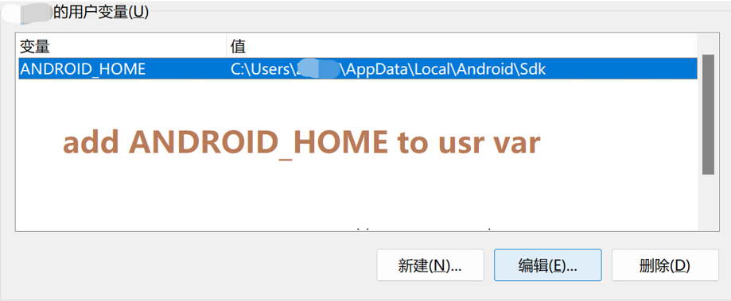

.. _android_studio_env:

Set up Android Environment with Android studio
========================================================

.. note:: 
    **Prerequisite:** Android Studio installed on your PC.

    Your can download Android studio in https://developer.android.com/studio.

.. tip:: 
    Kea relies on ``adb`` cmd to interact with android devices. The key is to make the ADB(Android Debug Bridge) cmd available.
    The following tutorial will help you setup the whole suite of Android sdk tools. But remember, add the ``adb`` cmd to path is enough for kea.

.. _path_setup:

1. Set up cmdline tools (adb)
~~~~~~~~~~~~~~~~~~~~~~~~~~~~~~~

MacOS and Linux
-------------------------------

With Andorid Studio installed on your PC. What you need to do is export the PATH variables to make them available in terminal.

See `Android studio doc: Environment variables <https://developer.android.com/tools/variables>`_ for details.

If you're using zsh, bash. Setup the ``ANDROID_HOME`` environment with ``EXPORT`` cmd. The ``ANDROID_HOME`` 
environment should refer to your sdk installation path. The default path is ``/usr/Library/Android/sdk/``. You
can check your installation path in Android Studio via :guilabel:`Android Studio` -> :guilabel:`Settings` -> :guilabel:`Language & Frameworks` -> :guilabel:`Android SDK`

In this window, checkout :guilabel:`SDK Tools`, install **Android SDK Platform Tools**.

.. figure:: ../../../images/android_home_path.jpg
    :align: center

    The sample of Android sdk path in Android Studio

Then, add the path in the .bashrc or .zshrc file.

.. code:: bash

    export ANDROID_HOME="/usr/.../Library/Android/sdk/"
    # Export all the cmd in the library.
    export PATH="$ANDROID_HOME/emulator:$ANDROID_HOME/tools:$ANDROID_HOME/cmdline-tools/latest/bin:$ANDROID_HOME/tools/bin:$ANDROID_HOME/cmdline-tools/latest:$ANDROID_HOME/platform-tools:$PATH"

``source`` the file to activate the modification.

.. important::
    Enter ``adb`` in your terminal to check if the setup succeed.

Windows
---------------

With Andorid Studio installed on your PC. What you need to do is export the PATH variables to make them available in terminal.

If you're using zsh, bash. Setup the ``ANDROID_HOME`` environment with ``EXPORT`` cmd. The ``ANDROID_HOME`` 
environment should refer to your sdk installation path. The default path is ``C:\Users\usr_name\AppData\Local\Android\Sdk``. You
can check your installation path in Android Studio via :guilabel:`File` -> :guilabel:`Settings` -> :guilabel:`Language & Frameworks` -> :guilabel:`Android SDK`

In this window, checkout :guilabel:`SDK Tools`, install **Android SDK Platform Tools**.

.. figure:: ../../../images/android_home_path_win.png
    :align: center

    The sample of Android sdk path in Android Studio

Then, add the following path to PATH var. See `How to Add to Windows PATH Environment Variable <https://helpdeskgeek.com/windows-10/add-windows-path-environment-variable/>`_.

.. code:: 

    ANDROID_HOME:
    C:\Users\usr_name\AppData\Local\Android\Sdk

    PATH:
    %ANDROID_HOME%\platform-tools
    %ANDROID_HOME%\emulator

    Add ANDROID_HOME to usr var

.. figure:: ../../../images/win_PATH2.png
    :align: center

    Add required tools to path var

.. important::
    Enter ``adb`` in your terminal to check if the setup succeed.

2. Run the emulator
~~~~~~~~~~~~~~~~~~~~~~~~~~~~~~~~
Run an Android emulator through Android Studio. Follow the following tutorial to create and run an emulator.

`Andorid Studio docs - Create and Manage Virtual Devices <https://developer.android.com/studio/run/managing-avds>`_

.. important:: 
    Run ``adb devices`` in your terminal. You should see your emulator listed like emulator-5554.

.. figure:: ../../../images/emulator.png
    :align: center

    You should see this scene if the setup succeed
