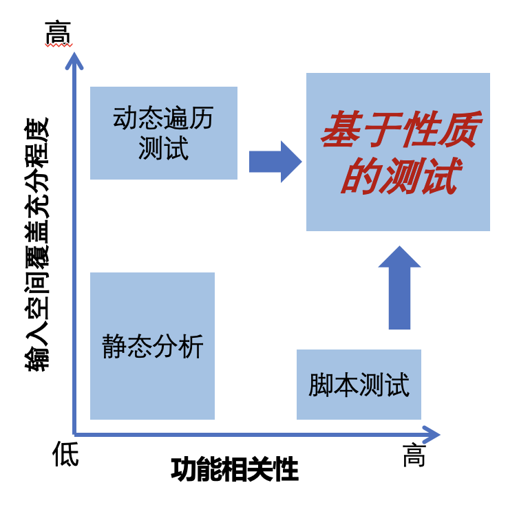

Kea 的优势
====================================

在传统的应用测试中，我们一般会进行静态分析，动态遍历测试，脚本测试。我们可以从 **输入空间** 、 **功能相关性** 两个
维度评估这些测试方法对 **功能性缺陷** 的查错能力。

- 静态分析的输入空间小，仅对源代码利用静态分析的算法进行分析。功能相关性低，分析难以贴近真实应用功能。

- 动态遍历测试(Fuzzing)的输入空间大，可以生成大量不同的输入，从而到达不同的应用状态。然而其功能相关性低，
  一个应用功能可由一条多个事件组合而成的路径表示，随机测试的过程难以完整走出一个完整的应用功能路径。

- 脚本测试的输入空间小，一个脚本测试由初始化，应用功能执行脚本及断言组成，始终为一个单一的路径。功能相关性高，
  每个脚本都定义了一个功能。

上述三种传统测试方法的能力可以通过以下的坐标图显示，此前没有一种测试方法能同时达成高输入空间和高功能相关性。
因此，我们提出将基于性质的测试方法应用于移动应用的功能测试领域，此方法能同时达成高功能相关性和高输入空间，从而对应用的功能正确性进行充分验证。

  Kea 与传统测试方法的能力对比示意图

这里列举了 Kea 的一些优势：

1. 基于性质的测试：Kea 引入了一种通用且实用的测试技术，基于性质的测试（PBT），能够有效验证应用的功能性。
   
2. 低维护成本：与传统的脚本测试相比，应用性质的维护成本较低，减少了测试人员的工作负担。

3. 强大的功能缺陷检测能力：Kea 在检测移动应用中的功能性缺陷方面非常强大，能够自动探索并验证应用的性质，快速发现潜在问题。

