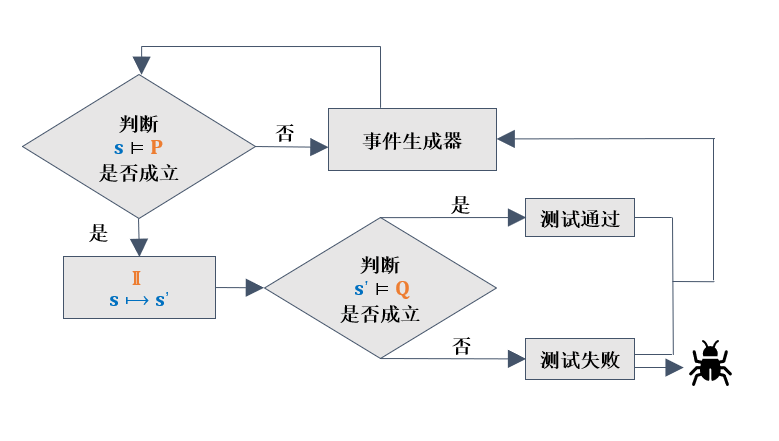

.. _kea_mechanism:

工作原理
========================

    kea 核心流程

Kea 的核心流程如上图，以下是一些执行流程的细节：

1. 步骤1：分析被测移动应用功能特性和测试目标，使用软件功能性质描述语言定义被测移动应用的功能性质集合，
每个功能性质包括前置条件 ``P`` 、交互场景 ``I`` 和后置条件 ``Q``；

2. 将所有定义的功能性质集合的并集存储下来，设置最大测试执行时长、最大执行事件个数，选择探索策略，
若选择随机探索策略，则执行步骤3；若选择主路径引导策略，则根据前置条件 ``P``，
定义一个用户事件序列作为主路径，继续执行步骤4；若选择大语言模型引导探索策略，则执行步骤5；

3. 使用随机探索策略生成事件序列，执行性质检测，记录对应的测试结果和用户界面截图，
直到达到最大测试执行时间，执行步骤6；:ref:`random`

4. 使用主路径引导策略生成事件序列，执行性质检测，记录对应的测试结果和用户界面截图，
直到达到最大测试执行时间，执行步骤6；:ref:`main_path`

5. 使用大语言模型引导策略生成事件序列，执行性质检测，记录对应的测试结果和用户界面截图，
直到达到最大测试执行时间，执行步骤6；:ref:`llm`

6. 基于测试结果和用户界面截图，自动生成被测移动应用的缺陷报告；
