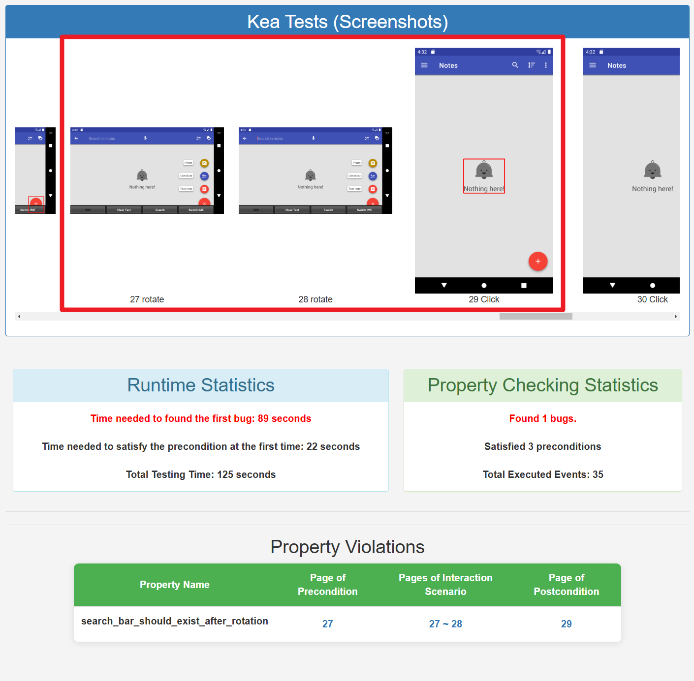

.. _bug_report_tutorial:

缺陷报告阅读指南
=================

        缺陷报告示意图

上面的图像是 Omninotes 的一个错误报告，用户在旋转屏幕后搜索栏消失了。
因此，这违反了 ``搜索框在旋转屏幕后需要任然存在`` 这一性质。

在测试执行完成之后，你可以在你设置的输出路径下看到 ``bug_report.html`` 。
你可以使用浏览器 (Google Chrome, Firefox等) 来打开这个 ``bug_report.html``。

报告顶部的记录了测试过程中每个用户界面状态的截图，可以帮助你识别和重现该错误。在每个截图下方，
你可以看到在该用户界面状态上执行的事件索引和事件类型 (例如 click, long click)。

``Time Consumption Statistics`` 模块记录了第一次违反性质的时间，第一次满足前置条件的时间，以及截至目前的测试总用时。

``Statisfaction Quantity Statistics`` 模块记录了截至目前违反性质和满足前置条件的总次数，以及总共操作的事件数。

``bug_report.html`` 界面下方的表格显示了性质违规列表，包含每个违背性质的 ``Precondition Page（前置条件界面）``, 
``Interaction Page（交互场景界面）`` 和 ``Postcondition Page（后置条件界面）``。
点击表格内链接将跳转到相应的截图，以帮助用户了解具体的bug触发情况。